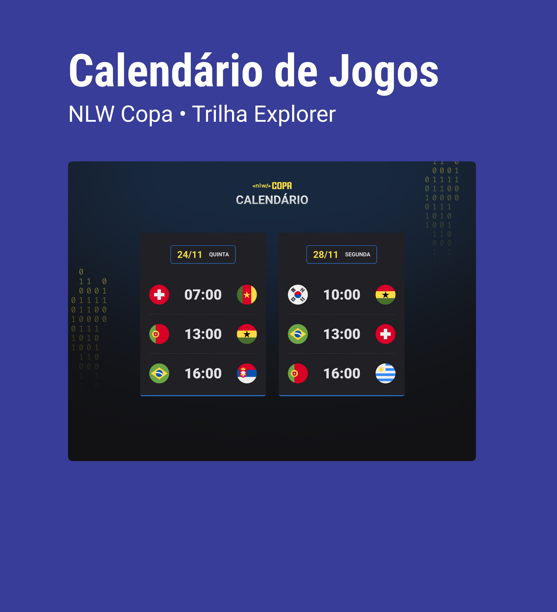

<h1 align="center"> NLW - Calendário Copa 2022 </h1>

Evento exclusivo e gratuito, promovido pela Rocketseat para ensino de tecnologias WEB.

  <a href="#-tecnologias">Tecnologias</a>&nbsp;&nbsp;&nbsp;|&nbsp;&nbsp;&nbsp;
  <a href="#-projeto">Projeto</a>&nbsp;&nbsp;&nbsp;|&nbsp;&nbsp;&nbsp;
  <a href="#-layout">Layout</a>&nbsp;&nbsp;&nbsp;|&nbsp;&nbsp;&nbsp;
  <a href="#-demonstração">Demo</a>&nbsp;&nbsp;&nbsp;|&nbsp;&nbsp;&nbsp;
  <a href="#memo-licença">Licença</a>

  

 

  

## 🚀 Tecnologias

Esse projeto foi desenvolvido com as seguintes tecnologias:

- HTML e CSS
- JavaScript
- Git e Github

## 💻 Projeto

Calendário da Copa do Mundo de Futebol 2022.

## 💻 Demonstração

https://joaovictorandradee.github.io/nlw-copa/

## 🔖 Layout

Você pode visualizar o layout do projeto através do [link no Figma](https://www.figma.com/file/01Q1puG6BFnVmHLlYzWuch/Calend%C3%A1rio-de-Jogos-(Community)?node-id=0%3A1). É necessário ter conta no [Figma](https://figma.com) para acessá-lo.

## :memo: Licença

Esse projeto está sob a licença MIT.

---

Feito por mim!

